# ⚛️ Atheism and Morality

, Most Gracious, Most Merciful. :no-zoom')

, Most Gracious, Most Merciful. :no-zoom')

Morality and the concepts of "good or bad," "right or wrong," and "just or unjust" are objectively defined by Allah (ﷻ). By definition, what is good or bad is what Allah (ﷻ) says it is, because He is Our Creator, thus He has revealed guidance in moral standards and principles which we have to follow.

Obedience to Allah (ﷻ)'s commandments is what is defined as good and disobedience to his commands is defined as bad. The logic is that simple.

Morality, just like angels, is a religious concept; seeing an atheist trying to prove objective morality is like seeing an atheist trying to prove angels' existence using a mindset that thinks Allah (ﷻ) doesn't exist, but angels are creations of Allah (ﷻ), after all, so this whole process remains illogical.

More psychologically developed atheists like Friedrich Nietzsche realized this:
<!-- tabs:start -->

### **<strong>The Twilight of Idols [^1] </strong>**

You have heard me call for philosophers to place themselves beyond good and evil, to rise above the illusion of moral judgment. This call is the result of an insight that I was the first to formulate: <mark>there are absolutely no moral facts. What moral and religious judgments have in common is the belief in things that are not real</mark>. Morality is just an interpretation of certain phenomena or (more accurately) a misinterpretation. <mark>Moral judgments, like religious ones</mark>, presuppose a level of ignorance in which even the concept of reality is missing and there is no distinction between the real and the imaginary; a level where 'truth' is the name for the very things that we now call 'illusions'. That is why moral judgments should never be taken literally: on their own, they are just absurdities. But semiotically, they are invaluable: if you know what to look for, moral judgments reveal the most valuable realities of the cultures and interiorities that did not know enough to understand themselves. Morality is just a sign language, just a symptomatology: you have to know what it means in order to take advantage of it.

<!-- tabs:end -->

In fact, even the learned atheist scholars admit that the role of creating objective morality is unattainable for actual human beings.

In other words, we can conclude that atheism has no objective morality. The best thing atheism can only do is to create subjective morality, and to logically determine what is good and what is bad, the possible grounding on which it stands on goes something like these:
1. The Harm Principle (removing or minimizing harm, maximizing pleasure and happiness)
2. Consent
3. Evolution (imitating animals to survive)

From this point, we will show how absurd such choices can be if they're used to differentiate between good and bad.

## 1. The Harm Principle
John Stewart Mill's famous principle, which in turn can be summarized as:
> "Do what ever you want as long as you don't harm anyone."

This logic is, however, highly contradictory to atheism; mountains of scientific studies have shown atheism is harmful to human health and society.

This large meta-analysis from **[ScienceDirect](<https://www.sciencedirect.com/science/article/abs/pii/S0140197111001138>)** shows how atheism harms people's well-being, mental health, and results in higher crime rates:

This atheist logic of promoting hedonism also permits things like rape, bestiality, child molestation, and other sexual deviances.

David Benatar, a known Atheist philosopher, explains that those who promote "sexual liberation" open the doors to rape as a "human right," now really:

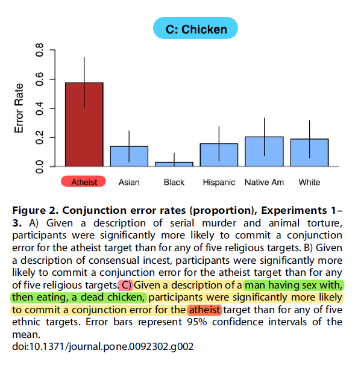

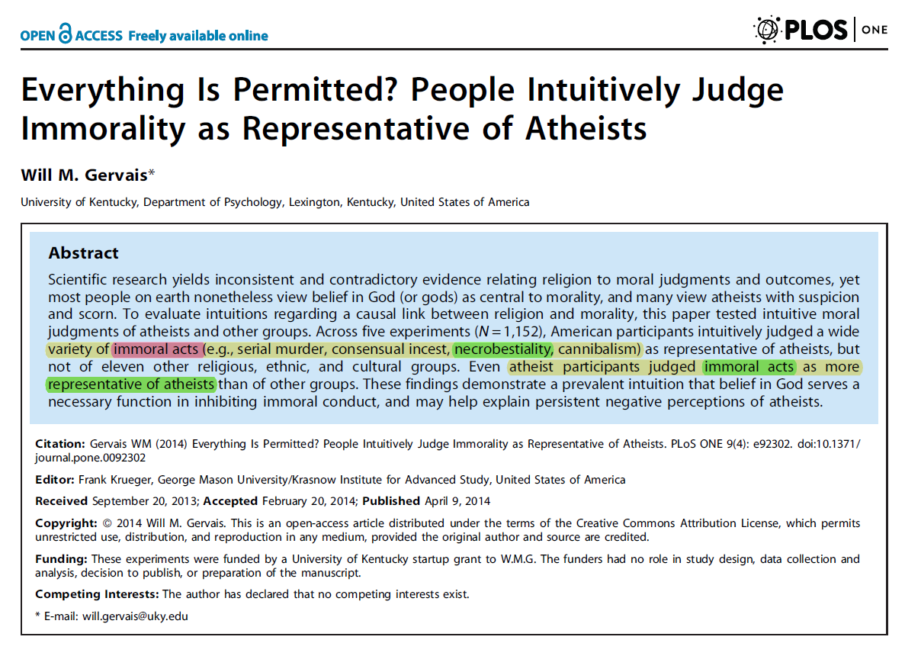

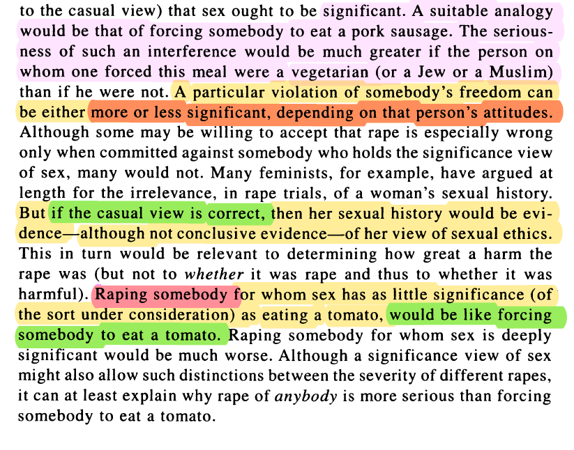

Although Reddit-type new-atheists won't admit it, actual academic atheist PhD philosophers like Benetar, Singer, Gule etc., will state that this is what subjective attempts at a secular liberal atheist moral framework logically lead to.

Even atheist activists who pretend to be philosophers like Lawrence Krauss, [a sex offender and Jeffrey Epstein's close friend](<https://www.azcentral.com/story/news/local/phoenix/2019/07/12/former-asu-physicist-lawrence-krauss-got-250-k-jeffrey-epstein/1718659001>), was forced in [a debate with Hamza Tzortzis](<https://youtu.be/uSwJuOPG4FI?start=4166&end=4263>) to admit that brother-sister incest is permissible according to atheistic views:

<video width="auto" controls>
  <source src="/Files/Videos/atheismandmorality/whyisincestwrong.mp4" type="video/mp4">
</video>

**[PLOS](<https://journals.plos.org/plosone/article?id=10.1371/journal.pone.0092302>)**' study on the topic of atheism and morality have found that even atheist participants judge immoral acts like incest, necrobestiality, serial murder and cannibalism as representatives of atheism:

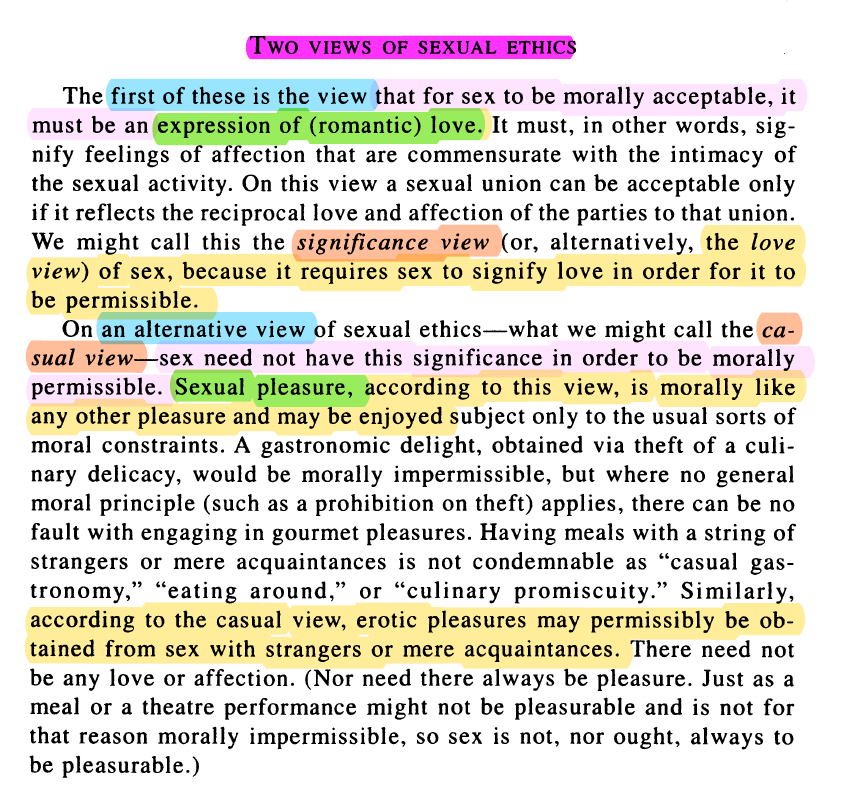

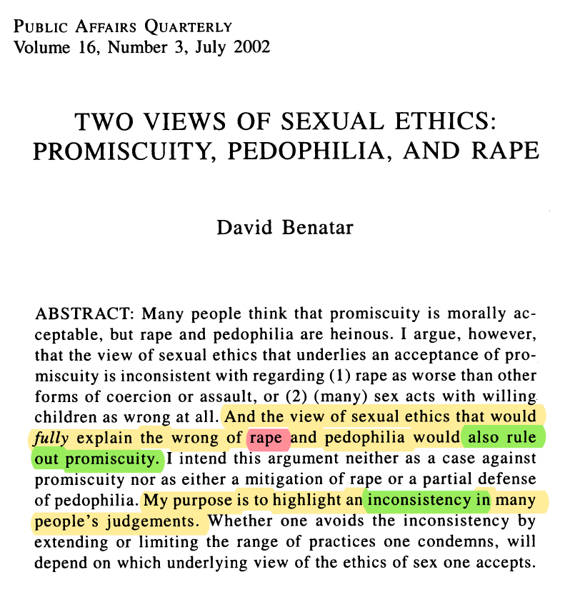

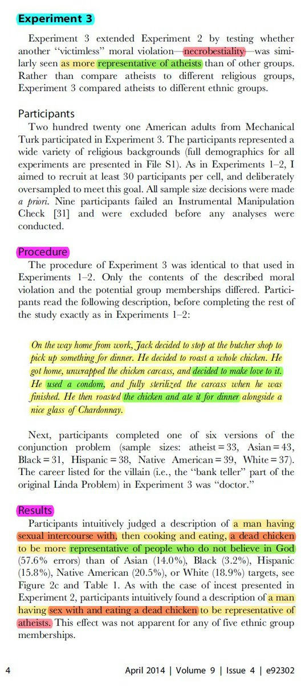

Therefore, the idea of the Harm Principle doesn't conform with atheism in the first place.

## 2. Consent
This also contradicts atheism, for the logical end conclusion of basing morality on consent is anti-natalism, summarized as:
> "Life is the ultimate evil since nobody consents to being born."

With the spread and acceptance of such an ideology, atheism will surely cause the extinction of the human race, according to David Benatar's **[Better Never to Have Been: The Harm of Coming into Existence](<https://academic.oup.com/book/32901>)**:

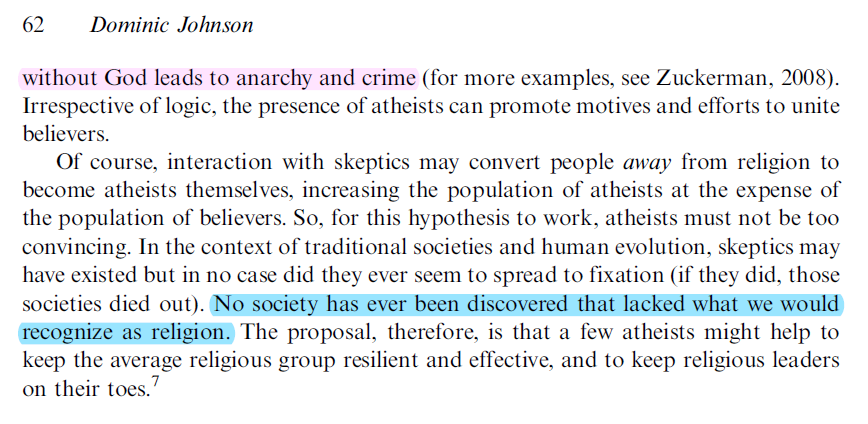

There's even a whole subreddit supporting anti-natalism, which I still consider to be the best community that describes those brainless Reddit-type new-atheists.

Of course, even if we do not go to this extreme conclusion, atheism also contradicts informed consent.

After all, no atheist informs religious people that atheism causes health problems, depression, and promotes [higher suicide rates](<https://link.springer.com/article/10.1007/s10943-009-9248-8>):

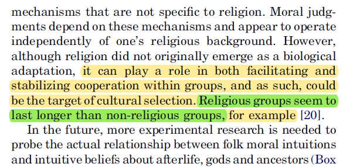

## 3. Evolution
Contradictory to atheism, as well. Ironic, isn't it?

Evolution stands by the claim that any deeper meaning to morality beyond survival, such as ethics, is illusory. But hypothetically, if evolution took us to a point where rape is added our survival, then it becomes moral according to the atheistic mindset; that's why Dawkins said rape being wrong is as arbitrary as us evolving to have 5 fingers instead of 6.

Secularism, by the way, which is a direct product of atheism, results in population decline and a civilization's eventual extinction. Atheist societies do not and cannot survive, according to [this](<https://osf.io/preprints/socarxiv/pvwpy>), [this](<https://www.cell.com/trends/cognitive-sciences/fulltext/S1364-6613(09)00289-7>), and [this](<https://www.tandfonline.com/doi/abs/10.1080/2153599X.2012.667948>):

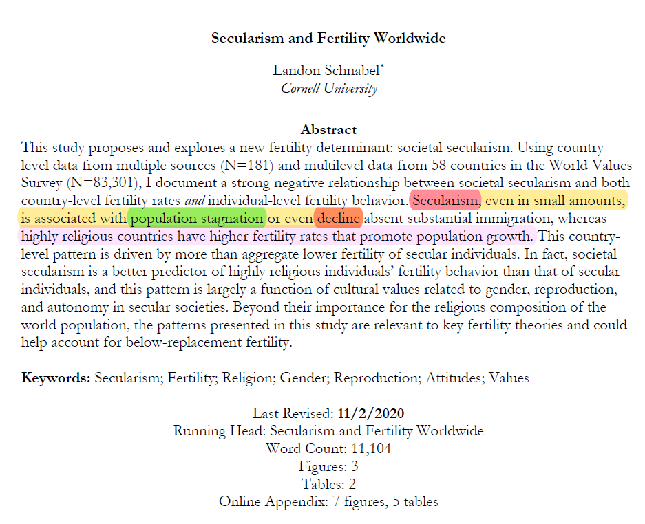

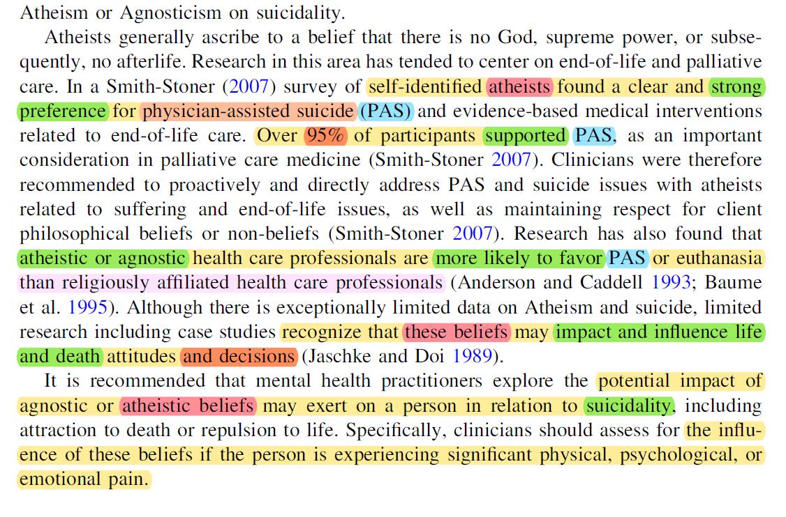

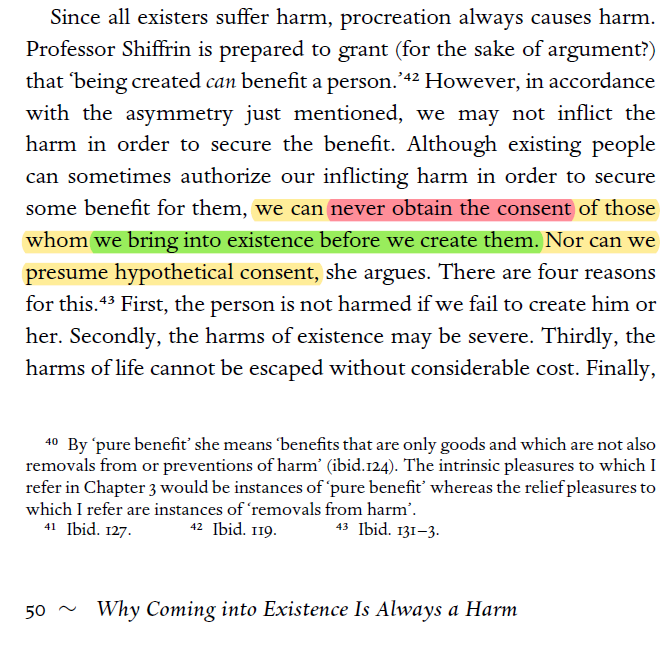

And, of course, we should not even need to explain why the behavior of animals should not be the basis for morality; animals don't have moral values, all they have is murder, rape, cannibalism, sacrifice, coprophagia, incest, necrophilia, pedophilia, sodomy, shamelessness, nudity, theft, and infanticide, just to name a few.

***

Atheism clearly has no morals.

Even their poor attempts to claim they have objective morals are easily refuted, not only by religious people, but by their own atheist academics, as well.

The only thing that holds atheists back from cannibalism, necro-beastiality and homosexual coprophagia is the authority of the laws of countries they reside in. No more than that.

According to atheism's worldview, the definitions of evil and good are nonsensical, for there is no difference between Adolf Hitler and Nelson Mandela; both are historical men, one exterminated thousands of people and the other fought for discrimination, but regardless, both will have the same end, that is meat for worms.

***

[^1]: The Twilight of Idols (1889) - Friedreich Nietzsche