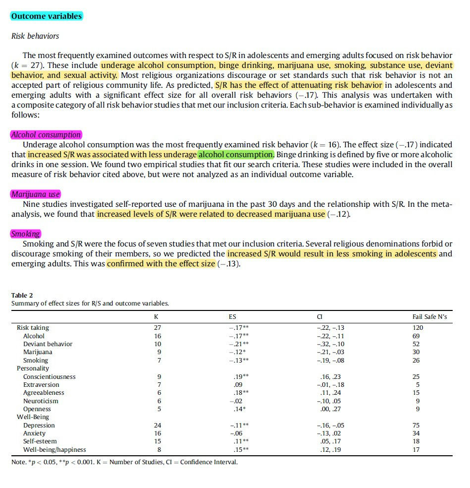
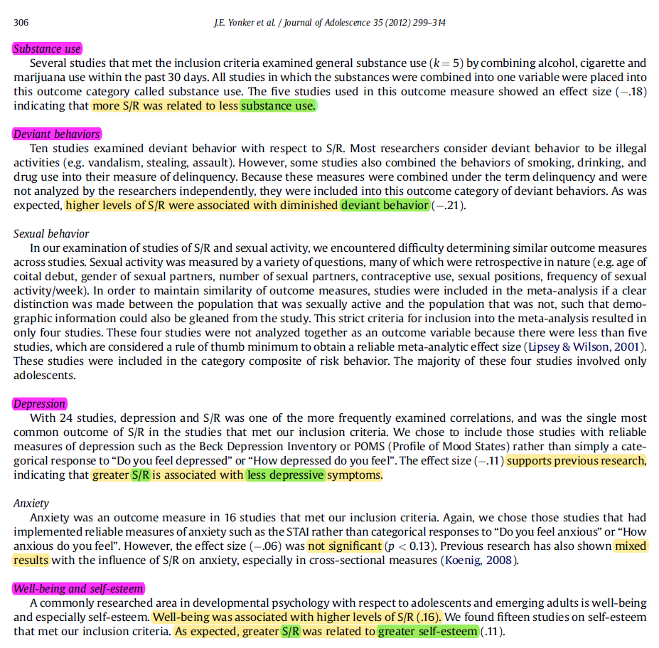
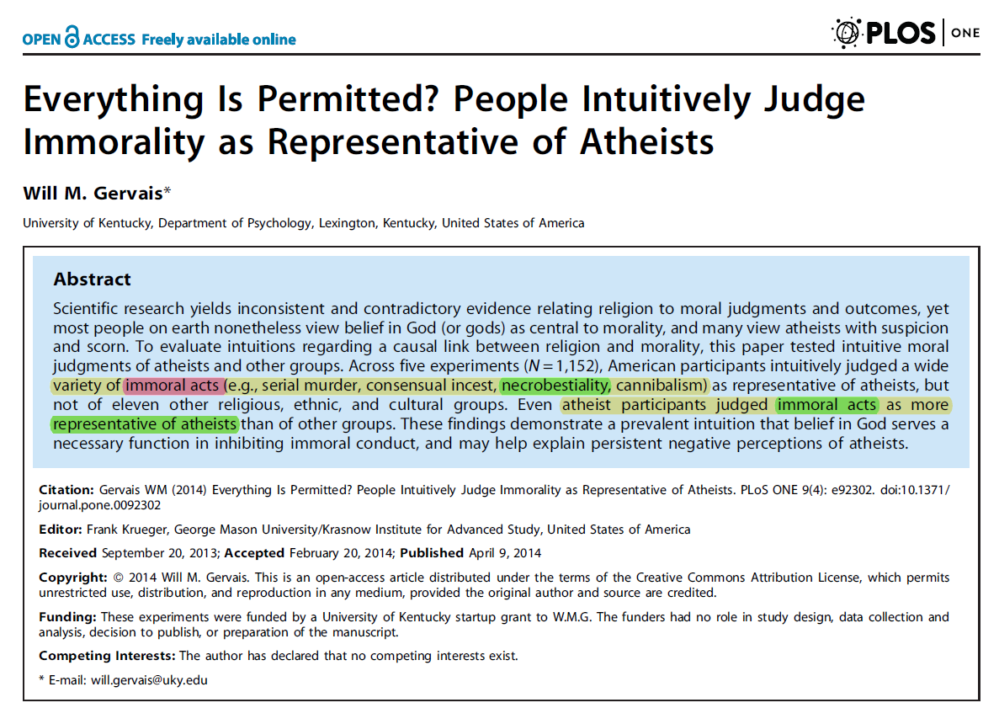
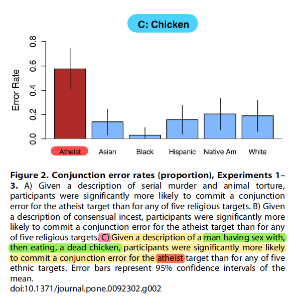
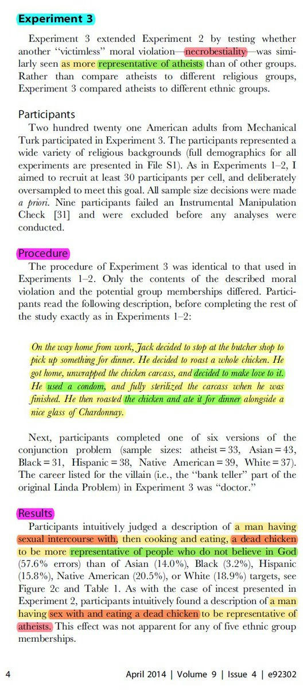
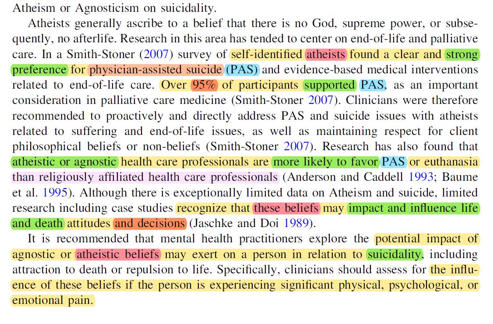
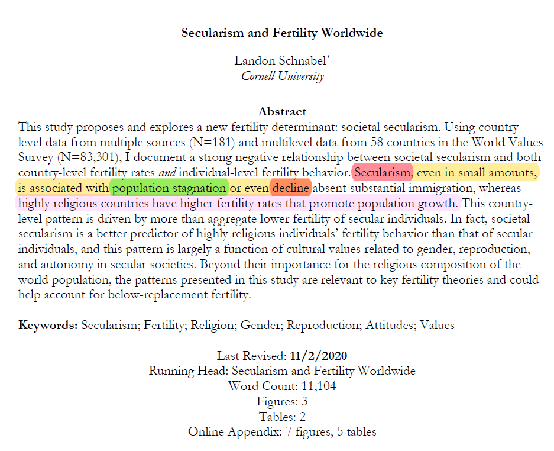
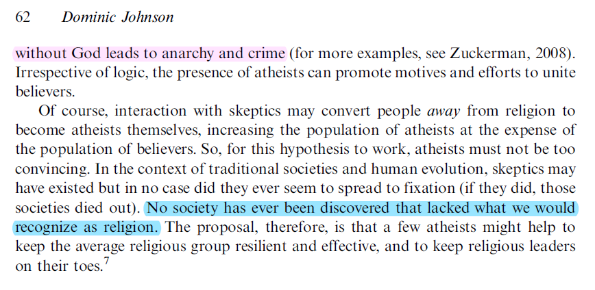
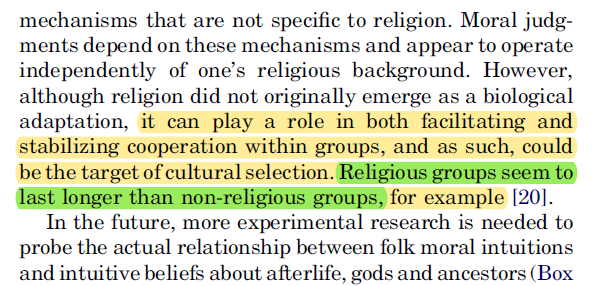

# ⚛️ Atheism and Morality

, Most Gracious, Most Merciful. :no-zoom')

, Most Gracious, Most Merciful. :no-zoom')

The overwhelming majority of atheist criticism against Islam and religion in general are moral claims, such as; Islam is violent, homophobic, pedophilic, etc. Yet to an intelligent person, this does not make sense; how do people without any moral foundation have the audacity to make moral arguments in the first place?

In short, there is something called "objective morality," and then there is "subjective morality." Subjectivity is opinion-based (e.g. "red is the best color"), whilst objectivity is fact checked (e.g. "2+2=4").

Atheists do not have any objective morality in the first place. What atheism can only do is create subjective morality. Atheists are criticizing Islam based on their own subjective personal opinions. They might as well say:
> "I hate Islam because Muslims like the color green, but my favorite color is blue."

Be not afraid of any of their moral judgements, because this be no different than the garbage they say currently, honestly.

In Islam; morality and the concepts of "good or bad," "right or wrong," and "just or unjust" are objectively defined by Allah (ﷻ). What is good or bad is what Allah (ﷻ) says it is, because He is Our Creator, thus He has revealed guidance in moral standards and principles which we have to follow.

Obedience to Allah (ﷻ)'s commandments is what is defined as good and disobedience to his commands is defined as bad. Our morality anchors on Allah (ﷻ). The logic is that simple.

Morality, just like angels, is a religious concept; seeing an atheist trying to prove objective morality is as absurd as seeing an atheist trying to prove angels' existence with an irreligious mindset, because angels are creations of Allah (ﷻ), after all, so this whole process remains illogical.

More psychologically developed atheists like Friedrich Nietzsche realized this:
<!-- tabs:start -->

### **<strong>The "Improvers" of Mankind (1) [^1] </strong>**

One knows my demand of philosophers that they place themselves beyond good and
evil – that they have the illusion of moral judgement beneath them. This demand
follows from an insight first formulated by me: that <mark>there are no moral facts
whatever. Moral judgement has this in common with religious judgement that it
believes in realities which do not exist.</mark> Morality is only an interpretation of certain
phenomena, more precisely a misinterpretation. <mark>Moral judgement belongs, as does
religious judgement, to a level of ignorance at which even the concept of the real,
the distinction between the real and the imaginary, is lacking: so that at such a level
'truth' denotes nothing but things which we today call 'imaginings'</mark>. To this extent
moral judgement is never to be taken literally: as such it never contains anything but
nonsense. But as semeiotics it remains of incalculable value: it reveals, to the
informed man at least, the most precious realities of cultures and inner worlds
which did not know enough to ‘understand’ themselves. Morality is merely sign-language, merely symptomatology: one must already know what it is about to
derive profit from it.

### **<strong>Expeditions of an Untimely Man (5) [^2] </strong>**

G. Eliot – They have got rid of the Christian God, and now feel obliged to cling all the more firmly to Christian morality: that is English consistency, let us not blame it on little bluestockings à la Eliot. In England, in response to every little emancipation from theology one has to reassert one's position in a fear-inspiring manner as a moral fanatic. That is the penance one pays there. – With us it is different. When one gives up Christian belief one thereby deprives oneself of the right to Christian morality. For the latter is absolutely not self-evident: one must make this point clear again and again, in spite of English shallowpates. Christianity is a system, a consistently thought out and complete view of things. If one breaks out of it a fundamental idea, the belief in God, one thereby breaks the whole thing to pieces: one has nothing of any consequence left in one's hands. Christianity presupposes that man does not know, cannot know what is good for him and what evil: he believes in God, who alone knows. <mark>Christian morality is a command: its origin is transcendental; it is beyond all criticism, all right to criticize; it possesses truth only if God is truth – it stands or falls with the belief in God</mark>. – If the English really do believe they will know, of their own accord, 'intuitively', what is good and evil; if they consequently think they no longer have need of Christianity as a guarantee of morality; that is merely the consequence of the ascendancy of Christian evaluation and an expression of the strength and depth of this ascendancy: so that the origin of English morality has been forgotten, so that the highly conditional nature of its right to exist is no longer felt. For the Englishman morality is not yet a problem...

<!-- tabs:end -->

In fact, even the learned atheist scholars, like Russ Shafer-Landau, admit that the role of creating objective morality is unattainable for actual human beings, unless by attaining some sort of a "divine god-like status," where no biases or personally cherished beliefs of any kind should be held, all while keeping a totally neutral standpoint, and let alone the need for an absolute authority to impose such morals on humanity as a whole:
<!-- tabs:start -->

### **<strong>I - Subjectivism and Objectivism [^3] </strong>**

Moral truth is constructed from the views taken from a perfectly informed and dispassionate standpoint, from the standpoint of pure practical reason. The preferred standpoint may be <mark>literally unattainable by actual human beings</mark>, or attainable only after securing an extreme kind of cognitive and affective detachment from the attitudes one at present possesses. We can understand many of the criticisms that are levelled against such theories as challenges to their claim to have satisfactorily achieved a neutral standpoint.

<!-- tabs:end -->

In other words, we can conclude that atheism has no objective morality, because no human being can hold absolute neutrality while dealing with such matters. The best thing atheism can only do is to create subjective morality since they detached morality from Allah (ﷻ) altogether, and to logically determine what is good and what is bad, the possible grounding on which it stands on goes something like these:
1. The Harm Principle (removing or minimizing harm)
2. Hedonism (maximizing pleasure and happiness)
3. Consent
4. Evolution (imitating animals to survive)
5. Empathy

From this point on, we will show how absurd such choices can be if they're used to differentiate between good and bad.

## 1. The Harm Principle
John Stewart Mill's famous principle; an improvement to Jeremy Bentham’s utilitarianism, which in turn can be summarized as:
> "Do what ever you want as long as you don't harm anyone."

<!-- tabs:start -->

### **<strong>On Liberty (16) [^4] </strong>**

Secondly, the principle requires liberty of tastes and
pursuits; of framing the plan of our life to suit our own character; of
<mark>doing as we like</mark>, subject to such consequences as may follow: without
impediment from our fellow creatures, <mark>so long as what we do does not
harm them, even though they should think our conduct foolish, perverse, or wrong</mark>. Thirdly, from this liberty of each individual, follows
the liberty, within the same limits, of combination among individuals;
freedom to unite, for any purpose <mark>not involving harm to others</mark>: the persons combining being supposed to be of full age, and not forced or
deceived.

<!-- tabs:end -->

This logic is, however, highly contradictory to atheism; mountains of scientific studies have shown atheism is harmful to human health and society.

This large meta-analysis from **[ScienceDirect](<https://www.sciencedirect.com/science/article/abs/pii/S0140197111001138>)** shows how atheism harms people's well-being, mental health, and results in higher crime rates:

Atheists can't consistently use this logic without also abandoning atheism itself; they cannot claim an action is morally wrong using the Harm Principle, since atheism itself is something that harms people, and therefore, by this reasoning, atheism itself is morally wrong.

## 2. Hedonism
A more outdated version of Mill's Harm Principle is heavily based on utilitarianism (i.e. maximizing net happiness in society). Hedonism, or pleasure seeking, is the basis for many liberal, feminist, and homosexual ethics. One of the strongest criticism of it is that it would allow gangrape, on the basis that a group of rapists would gain more total happiness than the victim gained any unhappiness such that the net happiness in the world has increased.

This atheist logic of promoting hedonism also permits things like rape, bestiality, child molestation, and other sexual deviances. David Benatar, a known Atheist philosopher, explains that those who promote "sexual liberation" open the doors to rape as a "human right," now really:
<!-- tabs:start -->

### **<strong>Abstract [^5] </strong>**

Many people think that promiscuity is morally acceptable, but rape and pedophilia are heinous. I argue, however, that the view of sexual ethics that underlies an acceptance of promiscuity is inconsistent with regarding (1) rape as worse than other forms of coercion or assault, or (2) (many) sex acts with willing children as wrong at all. <mark>And the view of sexual ethics that would fully explain the wrong of rape and pedophilia would also rule out promiscuity</mark>. I intend this argument neither as a case against promiscuity nor as either a mitigation of rape or a partial defense of pedophilia. <mark>My purpose is to highlight an inconsistency in many people's judgements</mark>. Whether one avoids the inconsistency by extending or limiting the range of practices one condemns, will depend on which underlying view of the ethics of sex one accepts.

### **<strong>Two Views of Sexual Ethics [^6] </strong>**

The first of these is the view that for sex to be morally acceptable, it must be an <mark>expression of (romantic) love</mark>. It must, in other words, signify feelings of affection that are commensurate with the intimacy of the sexual activity. On this view a sexual union can be acceptable only if it reflects the reciprocal love and affection of the parties to that union. We might call this <mark>the significance view (or, alternatively, the love view) of sex</mark>, because it requires sex to signify love in order for it to be permissible.

On an alternative view of sexual ethics; what we might call the <mark>casual view-sex need not have this significance in order to be morally permissible. Sexual pleasure, according to this view, is morally like any other pleasure and may be enjoyed subject only to the usual sorts of moral constraints</mark>. A gastronomic delight, obtained via theft of a culinary delicacy, would be morally impermissible, but where no general moral principle (such as a prohibition on theft) applies, there can be no fault with engaging in gourmet pleasures. Having meals with a string of strangers or mere acquaintances is not condemnable as "casual gastronomy," "eating around," or "culinary promiscuity." Similarly, according to the casual view, <mark>erotic pleasures may permissibly be obtained from sex with strangers or mere acquaintances</mark>. There need not be any love or affection. (Nor need there always be pleasure. Just as a meal or a theatre performance might not be pleasurable and is not for that reason morally impermissible, so sex is not, nor ought, always to be pleasurable.)

### **<strong>Implications of the Two Views [^7] </strong>**

Perhaps a proponent of the casual view could recognize that rape is especially wrong for those who do not share the casual view that is, for those who believe (mistakenly, according to the casual view) that sex ought to be significant. A suitable analogy would be that of <mark>forcing somebody to eat a pork sausage. The seriousness of such an interference would be much greater if the person on whom one forced this meal were a vegetarian (or a Jew or a Muslim) than if he were not. A particular violation of somebody's freedom can be either more or less significant, depending on that person's attitudes</mark>. Although some may be willing to accept that rape is especially wrong only when committed against somebody who holds the significance view of sex, many would not. Many feminists, for example, have argued at length for the irrelevance, in rape trials, of a woman's sexual history. <mark>But if the casual view is correct, then her sexual history would be evidence (although not conclusive evidence) of her view of sexual ethics</mark>. This in turn would be relevant to determining how great a harm the rape was (but not to whether it was rape and thus to whether it was harmful). <mark>Raping somebody for whom sex has as little significance (of the sort under consideration) as eating a tomato, would be like forcing somebody to eat a tomato</mark>. Raping somebody for whom sex is deeply significant would be much worse. Although a significance view of sex might also allow such distinctions between the severity of different rapes, it can at least explain why rape of anybody is more serious than forcing somebody to eat a tomato.

<!-- tabs:end -->

Although Reddit-type new-atheists won't admit it, actual academic atheist pseudo-philosophers, like Benetar, Singer, Gule etc., will state that this is what subjective attempts at a secular liberal atheist moral framework logically lead to.

Atheist philosopher, Dr. Lars Gule, states that bestiality should be permissible in his [debate with Mohammed Hijab](<>), "as long as it's not hurting the animal." This is similar to the views of atheists like Peter Singer PhD:

<video width="auto" controls>
  <source src="../Files/Videos/atheism-and-morality/lars-gule-beastiality.mp4" type="video/mp4">
  <track src="../Files/Videos/atheism-and-morality/lars-gule-beastiality.vtt" label="English" kind="captions" srclang="en-us" default >
</video>

Even high ranking leaders of new-atheist activism who pretend to be philosophers, like Lawrence Krauss, [a sex offender and Jeffrey Epstein's close friend](<https://www.azcentral.com/story/news/local/phoenix/2019/07/12/former-asu-physicist-lawrence-krauss-got-250-k-jeffrey-epstein/1718659001>), was forced in a [debate with Hamza Tzortzis](<https://youtu.be/uSwJuOPG4FI?start=4166&end=4263>) to admit that brother-sister incest is permissible according to atheistic views:

<video width="auto" controls>
  <source src="../Files/Videos/atheism-and-morality/lawrence-krauss-incest.mp4" type="video/mp4">
  <track src="../Files/Videos/atheism-and-morality/lawrence-krauss-incest.vtt" label="English" kind="captions" srclang="en-us" default >
</video>

**[PLOS](<https://journals.plos.org/plosone/article?id=10.1371/journal.pone.0092302>)**' study on the topic of atheism and morality have found that even atheist participants judge immoral acts like incest, necrobestiality, serial murder and cannibalism as representatives of atheism:

Therefore, the idea of the Harm Principle doesn't conform with atheism in the first place.

## 3. Consent
This also contradicts atheism, for the logical end conclusion of basing morality on consent is anti-natalism, summarized as:
> "Life is the ultimate evil since nobody consents to being born."

With the spread and acceptance of such an ideology, atheism will surely cause the extinction of the human race, according to David Benatar (who I personally consider as a clown and a walking contradiction):
<!-- tabs:start -->

### **<strong>Other Asymmetrics (50) [^8] </strong>**

Since all existers suffer harm, procreation always causes harm. Professor Shiffrin is prepared to grant (for the sake of argument?) that 'being created can benefit a person. However, in accordance with the asymmetry just mentioned, we may not inflict the harm in order to secure the benefit. Although existing people can sometimes authorize our inflicting harm in order to secure some benefit for them, <mark>we can never obtain the consent of those whom we bring into existence before we create them. Nor can we presume hypothetical consent</mark>, she argues. There are four reasons for this. First, the person is not harmed if we fail to create him or her. Secondly, the harms of existence may be severe. Thirdly, the harms of life cannot be escaped without considerable cost. Finally, the hypothetical consent is not based on the individual's values or attitudes towards risk.

<!-- tabs:end -->

There's even a whole subreddit supporting anti-natalism, which I still consider to be the best community that describes those brainless Reddit-type new-atheists.

Of course, even if we do not go to this extreme conclusion, atheism also contradicts informed consent.

After all, no atheist informs religious people that atheism causes health problems, depression, and promotes [higher suicide rates](<https://link.springer.com/article/10.1007/s10943-009-9248-8>), as far as I know:

## 4. Evolution
Contradictory to atheism, as well. Ironic, isn't it?

Secularism, the political philosophy of atheism, results in population decline and a civilization’s eventual extinction. Atheist societies are evolutionarily inferior, they can't survive.

In addition, evolution stands by the claim that any deeper meaning to morality beyond survival, such as ethics, is illusory. But hypothetically, if evolution took us to a point where rape is added our survival, then it becomes moral according to the atheistic mindset; that's why Dawkins said rape being wrong is as arbitrary as us evolving to have 5 fingers instead of 6.

Secularism, by the way, which is a direct product of atheism, results in population decline and a civilization's eventual extinction. Atheist societies do not and cannot survive, according to [this](<https://osf.io/preprints/socarxiv/pvwpy>), [this](<https://www.cell.com/trends/cognitive-sciences/fulltext/S1364-6613(09)00289-7>), and [this](<https://www.tandfonline.com/doi/abs/10.1080/2153599X.2012.667948>):

And, of course, we should not even need to explain why the behavior of animals should not be the basis for morality; animals don't have moral values, all they have is murder, rape, cannibalism, sacrifice, coprophagia, incest, necrophilia, pedophilia, sodomy, shamelessness, nudity, theft, and infanticide, just to name a few.

## 5. Empathy
"Empathy" is just [another term for morality](<https://journals.sagepub.com/doi/10.1177/1745691614545130>), and in this case, that would be circular reasoning.

***

Atheism clearly has no morals.

Even their poor attempts to claim they have objective morals are easily refuted, not only by religious people, but by their own atheist academics, as well.

The only thing that holds atheists back from cannibalism, necro-beastiality and homosexual coprophagia is the authority of the laws of countries they reside in. No more than that.

According to atheism's worldview, the definitions of evil and good are nonsensical, for there is no difference between Adolf Hitler and Nelson Mandela; both are historical men, one exterminated thousands of people and the other fought for discrimination, but regardless, both will have the same end, that is meat for worms.

Atheists attack Islam because we don't condone treating women like prostitutes and human sextoys, yet this same reasoning of sexual ethics permits rape, beastiality, and even child molestation. Atheism basically tells you to stop believing in Allah (ﷻ) and start believing that homosexuality, rape, child molestation, and the likes of these sexual deviances are "human rights."

The worshippers of "soyence" talk about how "religion harms people," yet no scientific evidence backs any of this up, and ironically mountains of scientific data show atheism harms people. They talk about "consent" yet misrepresent the harms of atheism in order to obtain an illegitimate consent. They worship evolution but do not realize atheism is evolutionarily inferior.

Don't be fooled by these hilariously bad arguments atheists make; none of them hold any ground once we begin to scrutinize it.

***

[^1]: Friedreich Wilhelm Nietzsche - The Twilight of the Idols and the Anti-Christ (1889) [The "Improvers" of Mankind (1)]

[^2]: Friedreich Wilhelm Nietzsche - The Twilight of the Idols and the Anti-Christ (1889) [Expeditions of an Untimely Man (5)]

[^3]: Russ Shafer-Landau - Moral Realism: A Defence [2 - The Constructivist Challenge (I - Subjectivism and Objectivism)]

[^4]: John Stewart Mill - On Liberty (1859) [Chapter 1 - Introductory (p. 16)]

[^5]: David Benatar - Two Views of Sexual Ethics: Promiscuity, Pedophilia, and Rape [Abstract]

[^6]: David Benatar - Two Views of Sexual Ethics: Promiscuity, Pedophilia, and Rape [Two Views of Sexual Ethics]

[^7]: David Benatar - Two Views of Sexual Ethics: Promiscuity, Pedophilia, and Rape [Implications of the Two Views]

[^8]: David Benatar - Better Never to Have Been: The Harm of Coming Into Existence [2 - Why Coming into Existence is Always (Other Asymmetrics (p.50))]

