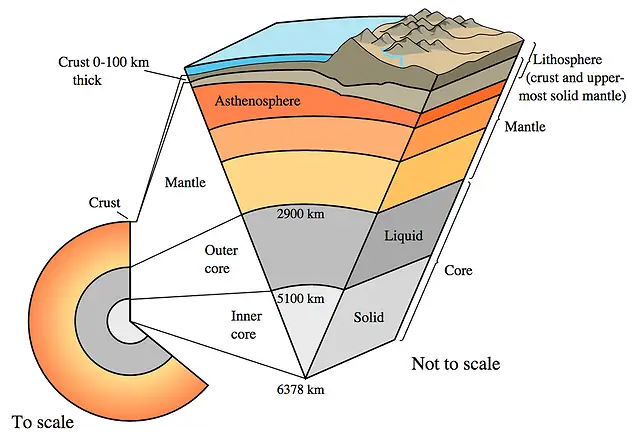

# Seven Earths

, Most Gracious, Most Merciful. :no-zoom')

, Most Gracious, Most Merciful. :no-zoom')

## Allegation
<!-- tabs:start -->

### **<strong>65:12</strong>**
<h3>
ٱللَّهُ ٱلَّذِى خَلَقَ <mark>سَبْعَ</mark> سَمَٰوَٰتٍ وَ<mark>مِنَ ٱلْأَرْضِ مِثْلَهُنَّ</mark> يَتَنَزَّلُ ٱلْأَمْرُ بَيْنَهُنَّ لِتَعْلَمُوٓا۟ أَنَّ ٱللَّهَ عَلَىٰ كُلِّ شَىْءٍ قَدِيرٌ وَأَنَّ ٱللَّهَ قَدْ أَحَاطَ بِكُلِّ شَىْءٍ عِلْمًۢا ۝
</h3>

***

It is Allah who has created <mark>seven</mark> heavens <mark>and of the earth, the like of them</mark>.

<!-- tabs:end -->

This verse is clearly implying that "seven earths" exist.

## Refutation
Even if we assume the existence of other separate earths, their existence is still just a theory, so it's never safe to assume their existence or non-existence. There is no scientific evidence to prove them or disprove them, therefore, this can't be classified as a "scientific error" at all, rather, it must just be a question of belief.

The point is; the verse quoted and criticized above is not even about seven separate earths. The word "earth" is singular, not plural. So it's not about "seven earths," but "seven of the earth," the like of "seven of the heavens." This is refering to layers, not other separate earths:
<!-- tabs:start -->

### **<strong>23:17</strong>**
<h3>
وَلَقَدْ خَلَقْنَا فَوْقَكُمْ <mark>سَبْعَ طَرَآئِقَ</mark> وَمَا كُنَّا عَنِ ٱلْخَلْقِ غَٰفِلِينَ ۝
</h3>

***

And We have created above you <mark>seven layered heavens</mark>, and never have We been unaware of creation.

### **<strong>67:3</strong>**
<h3>
ٱلَّذِى خَلَقَ سَبْعَ سَمَٰوَٰتٍ <mark>طِبَاقًا</mark> ۖ مَّا تَرَىٰ فِى خَلْقِ ٱلرَّحْمَٰنِ مِن تَفَٰوُتٍ ۖ فَٱرْجِعِ ٱلْبَصَرَ هَلْ تَرَىٰ مِن فُطُورٍ ۝
</h3>

***

He Who created the seven heavens <mark>one above another</mark>; no want of proportion wilt thou see in the Creation of (Allah) Most Gracious. So turn thy vision again; seest thou any flaw?

<!-- tabs:end -->

Further proof supporting this claim are the Prophet (ﷺ)'s own sayings:
<!-- tabs:start -->

### **<strong>Bukhari 3195</strong>**
<h3>
مَنْ ظَلَمَ قِيدَ شِبْرٍ <mark>طُوِّقَهُ مِنْ سَبْعِ أَرَضِينَ</mark>.‏
</h3>

***

Any person who takes even a span of land unjustly, his neck shall be <mark>encircled with it down seven earths</mark>.

### **<strong>Bukhari 3196</strong>**
<h3>
مَنْ أَخَذَ شَيْئًا مِنَ الأَرْضِ بِغَيْرِ حَقِّهِ <mark>خُسِفَ بِهِ</mark> يَوْمَ الْقِيَامَةِ <mark>إِلَى سَبْعِ أَرَضِينَ</mark>.‏
</h3>

***

Any person who takes a piece of land unjustly will <mark>sink down the seven earths</mark> on the Day of Resurrection.

### **<strong>Bukhari 3198</strong>**
<h3>
مَنْ أَخَذَ شِبْرًا مِنَ الأَرْضِ ظُلْمًا، فَإِنَّهُ <mark>يُطَوَّقُهُ يَوْمَ الْقِيَامَةِ مِنْ سَبْعِ أَرَضِينَ</mark>.‏
</h3>

***

If anyone takes a span of land unjustly, his neck will be <mark>encircled with it down seven earths</mark> on the Day of Resurrection.

<!-- tabs:end -->

Pondering on those sayings of Prophet Muhammad (ﷺ), we’ll find one that asserts the existence of the seven layers of the earth, concentric and one above the other. In the first mentioned hadith, it tells us that Allah (ﷻ) will punish those who oppress by encircling and surrounding their necks with seven earthly layers. The Prophet (ﷺ) here gave another characteristic of the layers, which is encirclement, by saying:
> "...encircled with it..."

This is how the layers truly look like; they are concentric and each one encircles the one underneath it. This is the reason why the Prophet (ﷺ) said, in the second mentioned hadith:
> "...sink down the seven earths..."

This indicates the stratification of those "earths" around one center, for the process of "sinking down" the seventh earth can't be possibly done if there were separate earths.

Now, I'm up for some simplistic scientific talk on the developement of researches on the earth's layer; when scientists started to probe the valleys of earth and in order to know its structure and constituents, they found that the tales and myths that dominated in the earlier centuries had no scientific basis. After scientists discovered that the earth is egg-shaped, they suggested that the core of this ball has a nucleus, and its shell is a very thin crust when compared to the earth's size, and between these two layers, there is a third, known as the mantle; this was the knowledge of the early scientists.

With further developement of researches, this "three layer" theory did not last for so long due to recent discoveries in geology. Recent measurements and experiments showed that the material comprising the nucleus of the earth is under very high pressure, three million times more than that on the surface of the earth. Under such pressure, matter transforms into solid state, this in turn makes earth’s core very solid, and this core is surrounded by a liquid layer of very high temperature. This means that there are two layers in earth's core and not one; one solid in the center surrounded by another liquid layer.

Thereafter, measuring devices advanced and presented to scientists a clear distinction among earth's inner layers. If we were to descend under the earth's crust we would find another layer of very hot stones, which is the stone cover or wrap. After that come three other distinct layers of varying density, pressure and temperature.

Therefore, scientists found themselves classifying the layers of earth into seven layers, no more nor less. The figure shows these layers with their dimensions (some are out of scale) according to what scientists have recently found using methods like earthquake measuring devices and the study of earth's magnetic field, among other techniques. These studies and discoveries are being taught to these scientists' students in universities:

<!-- tabs:start -->

### **<strong>Seven Layers of the Earth</strong>**
1. Crust
2. Lithosphere
3. Upper Mantle
4. Asthenosphere
5. Lower Mantle
6. Outer Core
7. Inner Core  

<!-- tabs:end -->

Scientists have found that the atom is also comprised of seven layers or levels, and this proves the uniformity of creation, where the earth has seven layers and the atoms have seven layers as well.

The earth's seven layers vary greatly in structure, density, temperature and material. Therefore one cannot consider that earth has only one layer as people anciently thought. Here we find that the idea of the earth having layers is fairly recent and wasn’t presented or brought forward at the time when the Quran was being revealed. Those discoveries are what the 21st century's scientists tell us, and what the 6th century's Quran told us; the Quran preceded scientists in mentioning earth's facts 14 centuries ago. Isn’t this an overwhelming Quranic miracle?