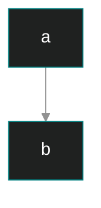

# 🧪 Test
, Most Gracious, Most Merciful. :no-zoom')

## Chat
<!-- chat:start -->
<!-- title:The "100% Nigga" Incident -->
### **MeD**
hello

### **Purse**
nigga nigga nigga nigga nigga nigga nigga, i'm <mark>100% nigga</mark>

### **MeD**
kys
<!-- chat:end -->

## Flexible Alerts

> [!NOTE]
> Note.

> [!COMMENT]
> Comment.

> [!TIP]
> Tip.

> [!WARNING]
> Warning.

> [!ATTENTION]
> Attention.

## Mermaid


## PDF Embed
```pdf
./Files/تخلص.pdf
```

## Tabs
<!-- tabs:start -->
### **<b>Bukhari</b>**
<h3><p style="text-align:center;">إِنَّمَا الْأَعْمَالُ بِالنِّيَّاتِ، وَإِنَّمَا لِكُلِّ امْرِئٍ مَا نَوَى، فَمَنْ كَانَتْ هِجْرَتُهُ إِلَى دُنْيَا يُصِيبُهَا أَوْ إِلَى امْرَأَةٍ يَنْكِحُهَا، فَهِجْرَتُهُ إِلَى مَا هَاجَرَ إِلَيْهِ</p></h3>

***

<p style="text-align:center;">The reward of deeds depends upon the intentions and every person will get the reward according to what he has intended. So whoever emigrated for worldly benefits or for a woman to marry, his emigration was for what he emigrated for.</p>

### **<b>Muslim</b>**
Bonjour!
<!-- tabs:start -->
### **Roma**
Niggerwigger
<!-- tabs:end -->
<!-- tabs:end -->


## WikiLink
[[iblis-angel-jinn#refutation|Is Iblis an angel or a jinn? - Refutation]]