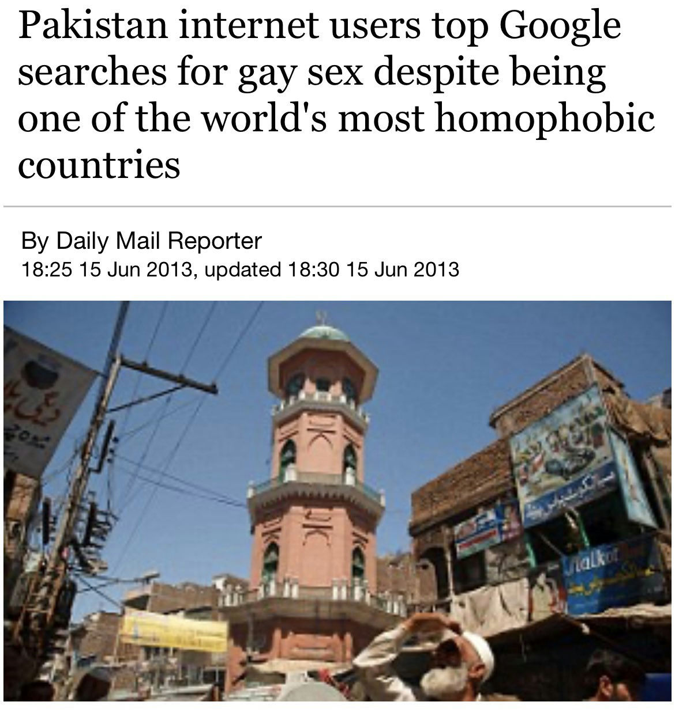
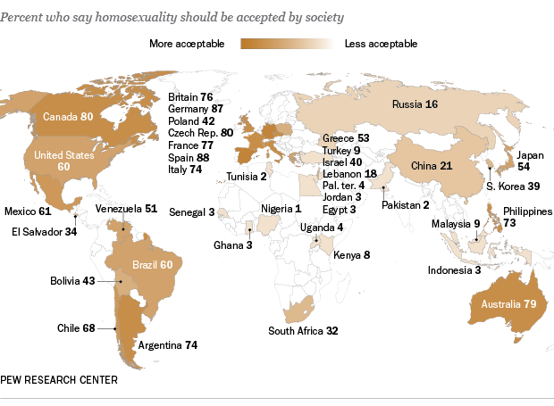

# 🇵🇰 The Islamic World and Gay Porn

, Most Gracious, Most Merciful. :no-zoom')

, Most Gracious, Most Merciful. :no-zoom')

## Allegation
The claim that Islamic countries being moral or virtuous is the funniest thing ever. [Pakistan](<https://www.dailymail.co.uk/news/article-2342217/Pakistan-internet-users-Google-searches-gay-sex-despite-worlds-homophobic-countries.html>), as an example, has 100 times our rules, but end up just as degenerate, if not more than we are:

## Refutation
As if a two-bit tabloid like the Daily Mail is somehow a reliable and trustworthy source. It says the data comes from Google Trends but Google Trends doesn't even show Pakistan to be in the top 10, or even top 20 if you include low search volume regions. Can't find any concrete statistics to back up what was written.

Also, 100 times your rules? Pakistan is a highly liberalized country, not even a "Muslim state" at all, as you desire to fantasize. The US began turning it into yet another Indian replica by replacing the past political system with a secular regime; similar to how the Jews, like Mustapha Kemal Ataturk, formulated a Turkish regime in which secularism and liberalism was its main grounding, influenced by European dictations. Basically, Pakistan is becoming the next Turkey because of the West, so don't blame Islam for that, smartass.

Using this logic of yours; the claim that Christian countries being moral or virtuous is the most hilarious lie ever. Just look at how addicted the Filipinos are to lolicon hentai, they're the top on all search engines! The Philippines is a haven for complete pedophiles.

This is just a sheer reminder that Google searches are not statistically representatives of Pakistani people, Filipinos, or any other people. You should get your hands on [actual statistics](<https://www.pewresearch.org/global/2013/06/04/global-acceptance-of-homosexuality>):
